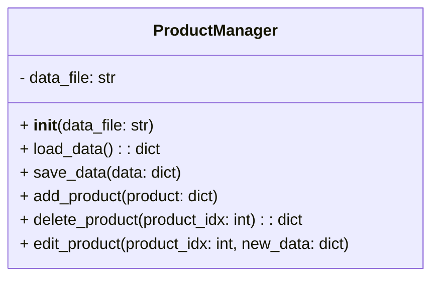

```mermaid
classDiagram
    class ProductManager {
        - data_file: str
        + __init__(data_file: str)
        + load_data(): dict
        + save_data(data: dict)
        + add_product(product: dict)
        + delete_product(product_idx: int): dict
        + edit_product(product_idx: int, new_data: dict)
    }
```