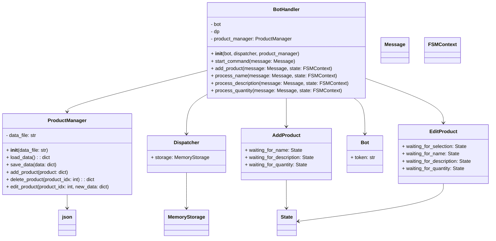

```mermaid
classDiagram
    class ProductManager {
        - data_file: str
        + __init__(data_file: str)
        + load_data(): dict
        + save_data(data: dict)
        + add_product(product: dict)
        + delete_product(product_idx: int): dict
        + edit_product(product_idx: int, new_data: dict)
    }

    class BotHandler {
        - bot
        - dp
        - product_manager: ProductManager
        + __init__(bot, dispatcher, product_manager)
        + start_command(message: Message)
        + add_product(message: Message, state: FSMContext)
        + process_name(message: Message, state: FSMContext)
        + process_description(message: Message, state: FSMContext)
        + process_quantity(message: Message, state: FSMContext)
    }

    class AddProduct {
        + waiting_for_name: State
        + waiting_for_description: State
        + waiting_for_quantity: State
    }

    class EditProduct {
        + waiting_for_selection: State
        + waiting_for_name: State
        + waiting_for_description: State
        + waiting_for_quantity: State
    }

    class Bot {
        + token: str
    }

    class Dispatcher {
        + storage: MemoryStorage
    }

    class MemoryStorage {
    }

    class Message {
    }

    class FSMContext {
    }

    ProductManager --> json
    BotHandler --> ProductManager
    BotHandler --> Bot
    BotHandler --> Dispatcher
    BotHandler --> AddProduct
    BotHandler --> EditProduct
    AddProduct --> State
    EditProduct --> State
    Dispatcher --> MemoryStorage
```