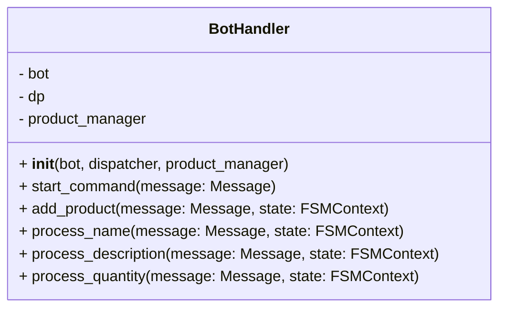

```mermaid
classDiagram
    class BotHandler {
        - bot
        - dp
        - product_manager
        + __init__(bot, dispatcher, product_manager)
        + start_command(message: Message)
        + add_product(message: Message, state: FSMContext)
        + process_name(message: Message, state: FSMContext)
        + process_description(message: Message, state: FSMContext)
        + process_quantity(message: Message, state: FSMContext)
    }
```