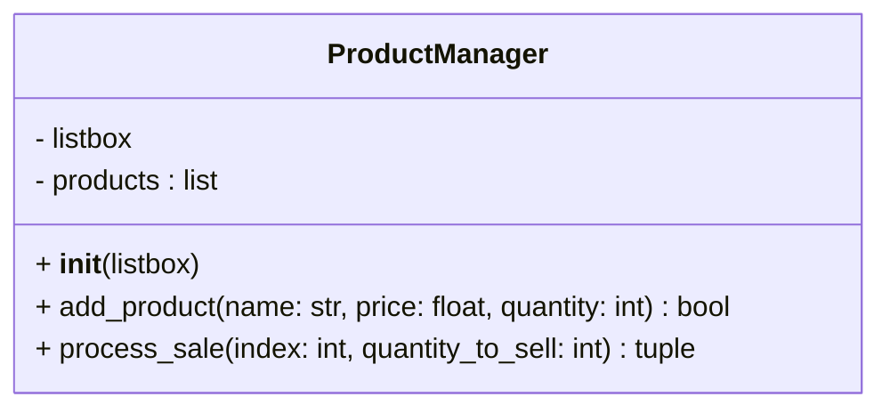

```mermaid
classDiagram
    class ProductManager {
        - listbox
        - products : list
        + __init__(listbox)
        + add_product(name: str, price: float, quantity: int) bool
        + process_sale(index: int, quantity_to_sell: int) tuple
    }

```