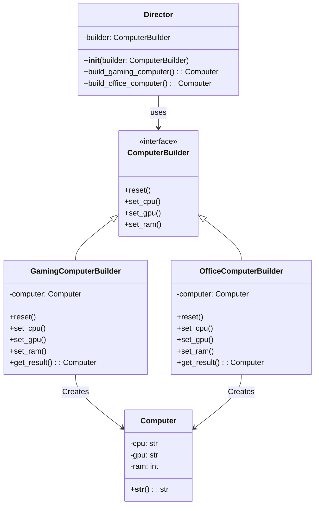

```mermaid
classDiagram
    class Computer {
        -cpu: str
        -gpu: str
        -ram: int
        +__str__(): str
    }

    class ComputerBuilder {
        <<interface>>
        +reset()
        +set_cpu()
        +set_gpu()
        +set_ram()
    }

    class GamingComputerBuilder {
        -computer: Computer
        +reset()
        +set_cpu()
        +set_gpu()
        +set_ram()
        +get_result(): Computer
    }

    class OfficeComputerBuilder {
        -computer: Computer
        +reset()
        +set_cpu()
        +set_gpu()
        +set_ram()
        +get_result(): Computer
    }

    class Director {
        -builder: ComputerBuilder
        +__init__(builder: ComputerBuilder)
        +build_gaming_computer(): Computer
        +build_office_computer(): Computer
    }

    Director --> ComputerBuilder : uses
    ComputerBuilder <|-- GamingComputerBuilder
    ComputerBuilder <|-- OfficeComputerBuilder
    GamingComputerBuilder --> Computer : Creates
    OfficeComputerBuilder --> Computer : Creates
```