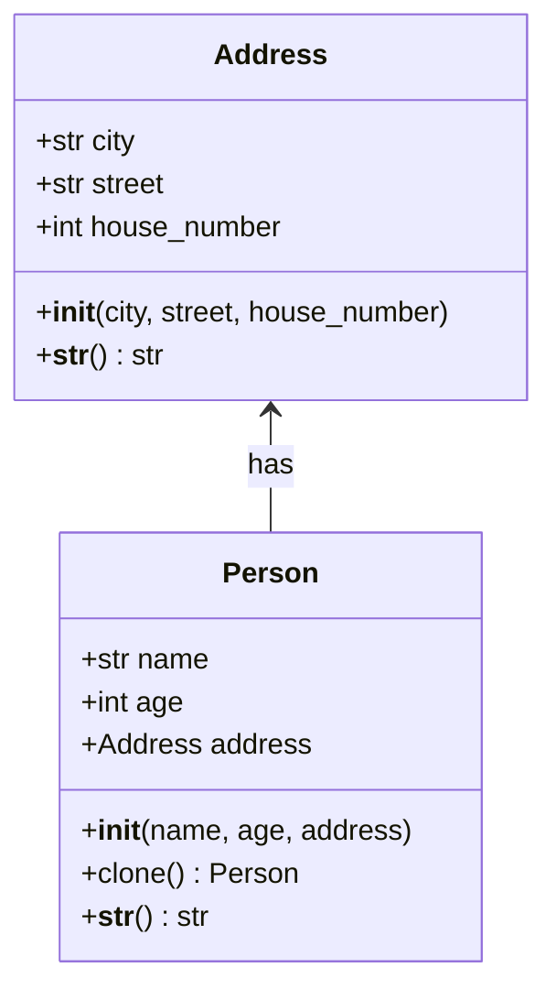

```mermaid
classDiagram
    class Address {
        +str city
        +str street
        +int house_number
        +__init__(city, street, house_number)
        +__str__() str
    }

    class Person {
        +str name
        +int age
        +Address address
        +__init__(name, age, address)
        +clone() Person
        +__str__() str
    }

    Address <-- Person : has
```