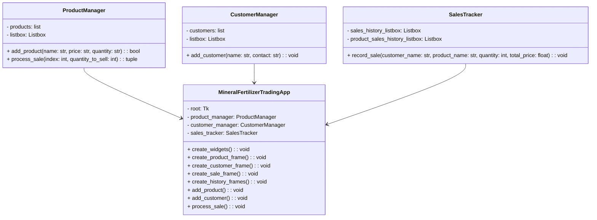

```mermaid
classDiagram
    class ProductManager {
        - products: list
        - listbox: Listbox
        + add_product(name: str, price: str, quantity: str): bool
        + process_sale(index: int, quantity_to_sell: int): tuple
    }

    class CustomerManager {
        - customers: list
        - listbox: Listbox
        + add_customer(name: str, contact: str): void
    }

    class SalesTracker {
        - sales_history_listbox: Listbox
        - product_sales_history_listbox: Listbox
        + record_sale(customer_name: str, product_name: str, quantity: int, total_price: float): void
    }

    class MineralFertilizerTradingApp {
        - root: Tk
        - product_manager: ProductManager
        - customer_manager: CustomerManager
        - sales_tracker: SalesTracker
        + create_widgets(): void
        + create_product_frame(): void
        + create_customer_frame(): void
        + create_sale_frame(): void
        + create_history_frames(): void
        + add_product(): void
        + add_customer(): void
        + process_sale(): void
    }

    ProductManager --> MineralFertilizerTradingApp
    CustomerManager --> MineralFertilizerTradingApp
    SalesTracker --> MineralFertilizerTradingApp
```