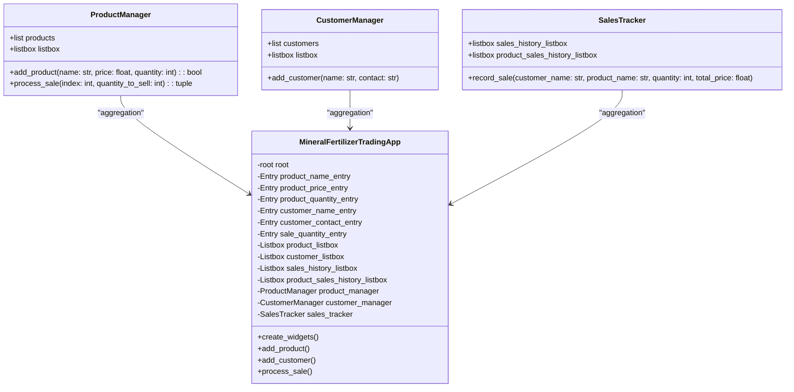

```mermaid
classDiagram
    class ProductManager {
        +list products
        +listbox listbox
        +add_product(name: str, price: float, quantity: int): bool
        +process_sale(index: int, quantity_to_sell: int): tuple
    }

    class CustomerManager {
        +list customers
        +listbox listbox
        +add_customer(name: str, contact: str)
    }

    class SalesTracker {
        +listbox sales_history_listbox
        +listbox product_sales_history_listbox
        +record_sale(customer_name: str, product_name: str, quantity: int, total_price: float)
    }

    class MineralFertilizerTradingApp {
        -root root
        -Entry product_name_entry
        -Entry product_price_entry
        -Entry product_quantity_entry
        -Entry customer_name_entry
        -Entry customer_contact_entry
        -Entry sale_quantity_entry
        -Listbox product_listbox
        -Listbox customer_listbox
        -Listbox sales_history_listbox
        -Listbox product_sales_history_listbox
        -ProductManager product_manager
        -CustomerManager customer_manager
        -SalesTracker sales_tracker
        +create_widgets()
        +add_product()
        +add_customer()
        +process_sale()
    }

    ProductManager --> MineralFertilizerTradingApp : "aggregation"
    CustomerManager --> MineralFertilizerTradingApp : "aggregation"
    SalesTracker --> MineralFertilizerTradingApp : "aggregation"
```