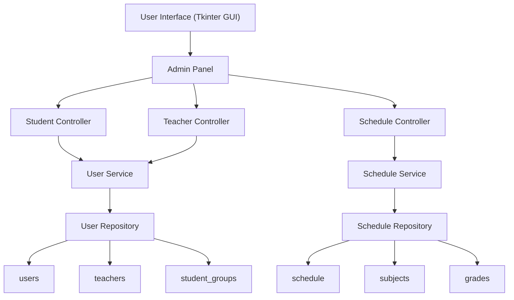

```mermaid
graph TD

GUI["User Interface (Tkinter GUI)"] --> AdminPanel["Admin Panel"]

AdminPanel --> StudentCtrl["Student Controller"]
AdminPanel --> TeacherCtrl["Teacher Controller"]
AdminPanel --> ScheduleCtrl["Schedule Controller"]

StudentCtrl --> UserService["User Service"]
TeacherCtrl --> UserService
ScheduleCtrl --> ScheduleService["Schedule Service"]

UserService --> UserRepo["User Repository"]
ScheduleService --> ScheduleRepo["Schedule Repository"]

UserRepo --> UsersTable["users"]
UserRepo --> TeachersTable["teachers"]
UserRepo --> GroupsTable["student_groups"]

ScheduleRepo --> ScheduleTable["schedule"]
ScheduleRepo --> SubjectsTable["subjects"]
ScheduleRepo --> GradesTable["grades"]
```
