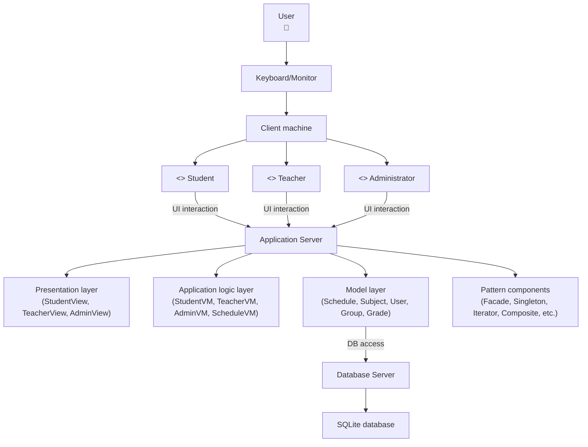

```mermaid
graph TD
  User[User<br>👤]
  KeyboardMonitor[Keyboard/Monitor]

  ClientMachine["Client machine"]
  componentStudent["<<component>> Student"]
  componentTeacher["<<component>> Teacher"]
  componentAdmin["<<component>> Administrator"]

  ApplicationServer["Application Server"]
  PresentationLayer["Presentation layer<br>(StudentView, TeacherView, AdminView)"]
  LogicLayer["Application logic layer<br>(StudentVM, TeacherVM, AdminVM, ScheduleVM)"]
  ModelLayer["Model layer<br>(Schedule, Subject, User, Group, Grade)"]
  PatternComponents["Pattern components<br>(Facade, Singleton, Iterator, Composite, etc.)"]

  DatabaseServer["Database Server"]
  SQLite["SQLite database"]

  %% Connections
  User --> KeyboardMonitor
  KeyboardMonitor --> ClientMachine

  ClientMachine --> componentStudent
  ClientMachine --> componentTeacher
  ClientMachine --> componentAdmin

  componentStudent -->|UI interaction| ApplicationServer
  componentTeacher -->|UI interaction| ApplicationServer
  componentAdmin -->|UI interaction| ApplicationServer

  ApplicationServer --> PresentationLayer
  ApplicationServer --> LogicLayer
  ApplicationServer --> ModelLayer
  ApplicationServer --> PatternComponents

  ModelLayer -->|DB access| DatabaseServer
  DatabaseServer --> SQLite
```
