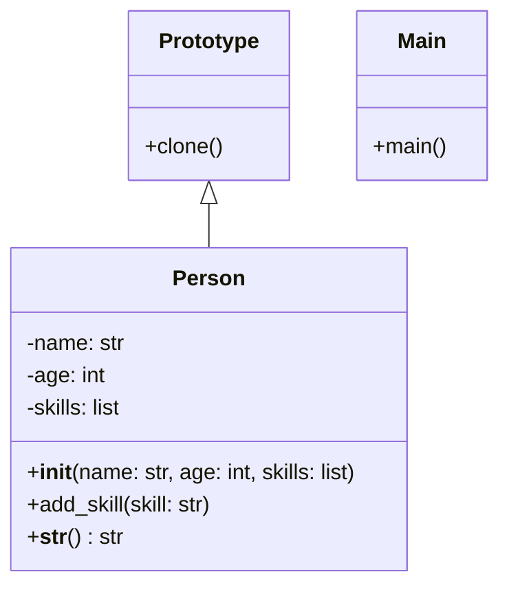

```mermaid
classDiagram
    class Prototype {
        +clone()
    }

    class Person {
        -name: str
        -age: int
        -skills: list
        +__init__(name: str, age: int, skills: list)
        +add_skill(skill: str)
        +__str__() str
    }

    Prototype <|-- Person

    class Main {
        +main()
    }
```