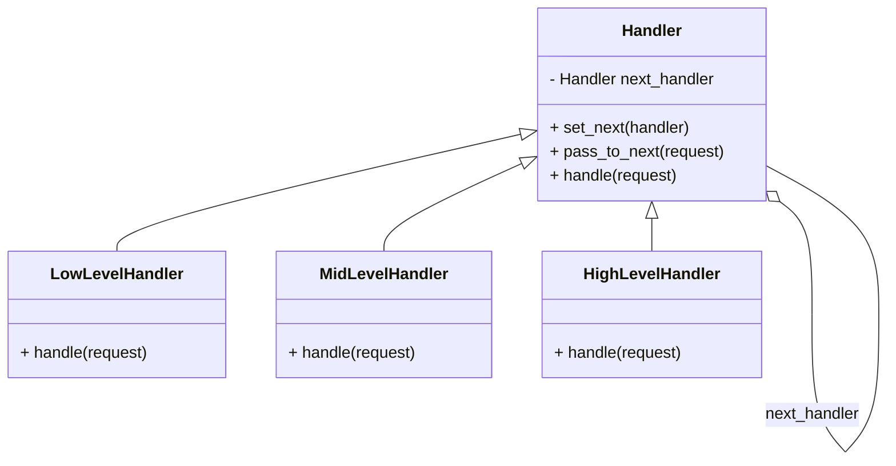

```mermaid
classDiagram
    class Handler {
        - Handler next_handler
        + set_next(handler)
        + pass_to_next(request)
        + handle(request)
    }
    class LowLevelHandler {
        + handle(request)
    }
    class MidLevelHandler {
        + handle(request)
    }
    class HighLevelHandler {
        + handle(request)
    }

    Handler <|-- LowLevelHandler
    Handler <|-- MidLevelHandler
    Handler <|-- HighLevelHandler
    Handler o-- Handler : next_handler
```