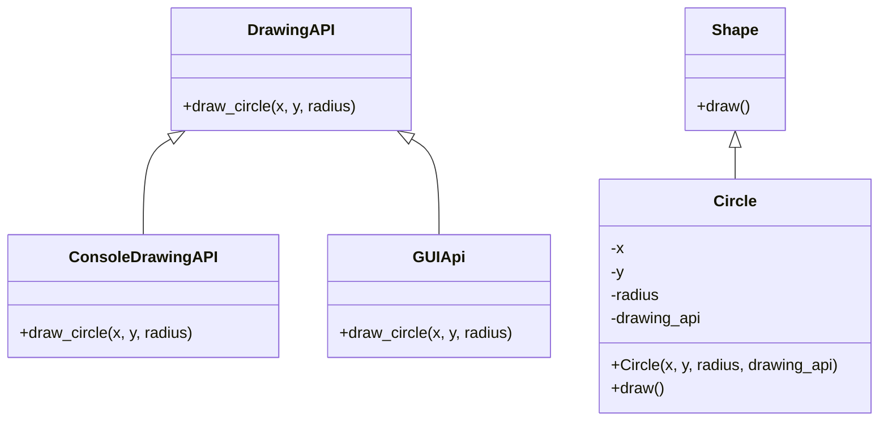

```mermaid
classDiagram
    class DrawingAPI {
        +draw_circle(x, y, radius)
    }

    class ConsoleDrawingAPI {
        +draw_circle(x, y, radius)
    }

    class GUIApi {
        +draw_circle(x, y, radius)
    }

    class Shape {
        +draw()
    }

    class Circle {
        -x
        -y
        -radius
        -drawing_api
        +Circle(x, y, radius, drawing_api)
        +draw()
    }

    DrawingAPI <|-- ConsoleDrawingAPI
    DrawingAPI <|-- GUIApi
    Shape <|-- Circle
```